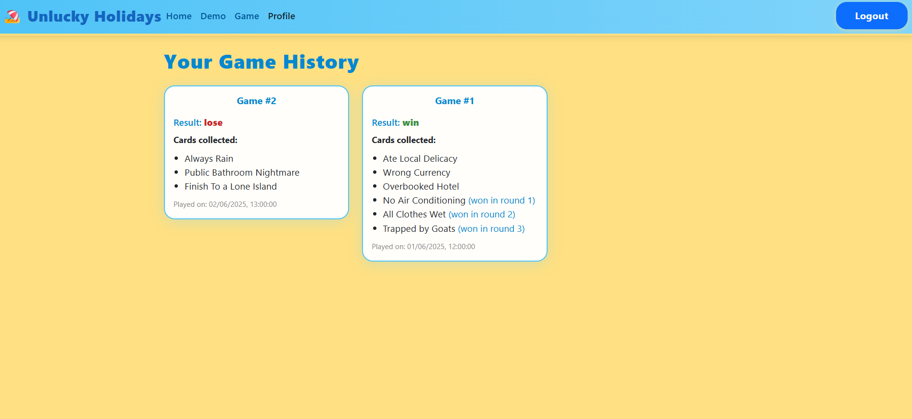
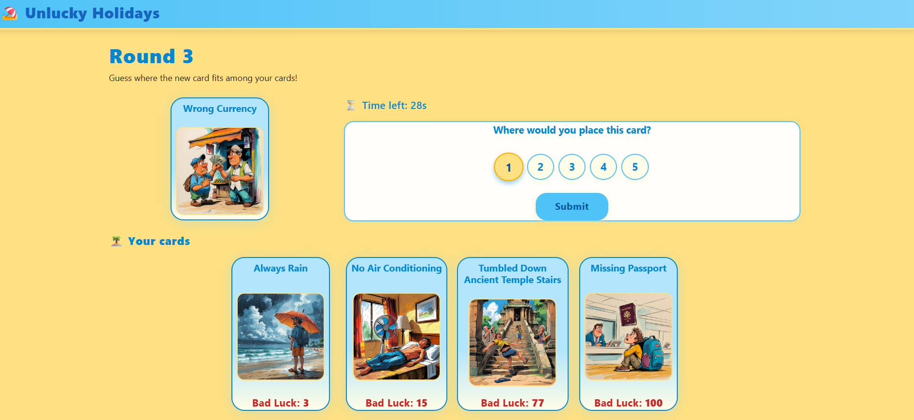

[](https://classroom.github.com/a/uNTgnFHD)
# Exam #1: "Game of Misfortune" (Unlucky Holidays)
## Student: s341987 DOMIZIO MATTIA

## React Client Application Routes

- Route `/` (Home): welcome page with game instructions, login/demo/game buttons. Shows introduction and rules (game button is visible only to logged-in users)
- Route `/login`: login form for registered users. Allows authentication and redirects to home on success
- Route `/demo`: demo game page for guests. Lets users play a single round with 3 random cards, no login required
- Route `/game`: main game page for logged-in users. Handles the full game flow (initial cards, rounds, win/lose logic)
- Route `/profile`: user profile page (only for logged-in users). Shows the history of completed games, with details of cards and results
- All other routes -> NotFound page

## API Server

### __Demo: Initial Cards__

URL: `/api/demo/initial-cards`

HTTP Method: GET

Description: Returns 3 random cards to start a demo game (anonymous user).

Response: `200 OK` (array of cards) or `500 Internal Server Error`.

Response body:
```
[
  {
    "id": 1,
    "title": "Your airplane is late",
    "image_path": "Your airplane is late.jpg",
    "bad_luck_index": 12.5
  },
  {
    "id": 2,
    "title": "Lost your luggage",
    "image_path": "Lost your luggage.jpg",
    "bad_luck_index": 15.0
  },
  {
    "id": 3,
    "title": "Sunburn on the first day",
    "image_path": "Sunburn on the first day.jpg",
    "bad_luck_index": 18.0
  }
]
```

---

### __Demo: Next Card to Guess__

URL: `/api/demo/next-card`

HTTP Method: POST

Request body:
```
{
  "exclude": [1,2,3]
}
```

- Alternatively, for backward compatibility, you can also use:
```
{
  "usedIds": [1,2,3]
}
```

Description: Returns a new random card (without bad_luck_index) different from those already shown. The backend receives the list of already used card ids in the body (as `exclude` or `usedIds`) and guarantees exclusion

Response: `200 OK` (card) or `404 Not Found` (no more cards available) or `500 Internal Server Error`.

Response body:
```
{
  "id": 4,
  "title": "You leave phone at home",
  "image_path": "You leave phone at home.jpg"
}
```

---

### __Demo: Check Card Position (anonymous user)__

URL: `/api/demo/guessed`

HTTP Method: POST

Request body:
```
{
  "guessIndex": 1,
  "cardToGuessId": 4,
  "initialCards": [1, 2, 3]
}
```

Description: Checks if the guessed position for the card is correct with respect to the initial cards.

Response: `200 OK` (result) or `422 Unprocessable Entity` (invalid parameters) or `500 Internal Server Error`.

Response body (if correct):
```
{
  "guessed": 1,
  "card": {
    "id": 1,
    "title": "Your airplane is late",
    "image_path": "Your airplane is late.jpg",
    "bad_luck_index": 12.5
  }
}
```
Response body (if wrong):
```
{
  "guessed": 0
}
```

---

### __Create New Game__

URL: `/api/games`

HTTP Method: POST

Request body (empty):
```
{}
```

Description: Creates a new game for the authenticated user. The creation date (`created_at`) is generated by the backend. The game is created with `ended_at` and `result` set to NULL (game in progress).

Response: `201 Created` (game id) or `503 Service Unavailable`.

Response body:
```
{
  "id": 1
}
```

---

### __End Game__

URL: `/api/games/:gameId/end`

HTTP Method: PUT

Request body:
```
{
  "result": "win" // or "lose"
}
```

Description: Ends the game, setting the end date (`ended_at`, generated by the backend) and the result (`result`).

Response: `200 OK` (object with changes) or `404 Not Found` or `422 Unprocessable Entity` or `503 Service Unavailable`.

Response body:
```
{
  "changes": 1
}
```

---

### __Get Game by ID__

URL: `/api/games/:gameId`

HTTP Method: GET

Description: Returns the data of a game (only if owner).

Response: `200 OK` (game) or `404 Not Found` or `500 Internal Server Error`.

Response body:
```
{
  "id": 1,
  "user_id": 1,
  "created_at": "2025-06-05T12:00:00Z",
  "ended_at": "2025-06-05T12:10:00Z",
  "result": "win"
}
```

---

### __Initial Cards of a Game__

URL: `/api/games/:gameId/initial-cards`

HTTP Method: GET

Description: Returns the 3 initial cards of a game (only if owner).

Response: `200 OK` (array of cards) or `500 Internal Server Error`.

Response body:
```
[
  {
    "id": 1,
    "title": "Your airplane is late",
    "image_path": "your_airplane_is_late.jpg",
    "bad_luck_index": 12.5
  },
  {
    "id": 2,
    "title": "Lost your luggage",
    "image_path": "Lost your luggage.jpg",
    "bad_luck_index": 15.0
  },
  {
    "id": 3,
    "title": "Sunburn on the first day",
    "image_path": "Sunburn on the first day.jpg",
    "bad_luck_index": 18.0
  }
]
```

---

### __User's Game History__

URL: `/api/games`

HTTP Method: GET

Description: Returns the list of games for the authenticated user, ordered by date.

Response: `200 OK` (array of games) or `500 Internal Server Error`.

Response body:
```
[
  {
    "id": 1,
    "user_id": 1,
    "created_at": "2025-06-05T12:00:00Z",
    "ended_at": "2025-06-05T12:10:00Z",
    "result": "win"
  },
  {
    "id": 2,
    "user_id": 1,
    "created_at": "2025-06-04T15:00:00Z",
    "ended_at": "2025-06-04T15:08:00Z",
    "result": "lose"
  }
]
```

---

### __Next Card in Game__

URL: `/api/games/:gameId/next-card`

HTTP Method: POST

Description: Extracts a new random card for the game (excluding all cards already used in this game), saves it in GAMECARD, and returns it. The card is returned **without bad_luck_index** (bad_luck_index is shown only if the card is guessed correctly).

Response: `200 OK` (card) or `404 Not Found` (no more cards available) or `500 Internal Server Error`.

Response body:
```
{
  "id": 4,
  "title": "You leave phone at home",
  "image_path": "You leave phone at home.jpg"
}
```

---

### __All Cards of a Game__

URL: `/api/games/:gameId/gamecards`

HTTP Method: GET

Description: Returns all cards associated with a game (only if owner).

Response: `200 OK` (array of objects `{ gameCard, card }`) or `500 Internal Server Error`.

Response body (game in progress):
```
[
  {
    "gameCard": {
      "id": 1,
      "game_id": 1,
      "card_id": 1,
      "round_number": null,
      "initial": 1,
      "guessed": null
    },
    "card": {
      "id": 1,
      "title": "Your airplane is late",
      "image_path": "your_airplane_is_late.jpg",
      "bad_luck_index": 12.5
    }
  },
  {
    "gameCard": {
      "id": 2,
      "game_id": 1,
      "card_id": 2,
      "round_number": 2,
      "initial": 0,
      "guessed": 1
    },
    "card": {
      "id": 2,
      "title": "Lost your luggage",
      "image_path": "Lost your luggage.jpg",
      "bad_luck_index": 15.0
    }
  }
]
```
Response body (game finished):
```
[
  {
    "gameCard": {
      "id": 1,
      "game_id": 1,
      "card_id": 1,
      "round_number": null,
      "initial": 1,
      "guessed": null
    },
    "card": {
      "id": 1,
      "title": "Your airplane is late"
    }
  },
  {
    "gameCard": {
      "id": 2,
      "game_id": 1,
      "card_id": 2,
      "round_number": 2,
      "initial": 0,
      "guessed": 1
    },
    "card": {
      "id": 2,
      "title": "Lost your luggage"
    }
  }
]
```

---

### __Set Card as Guessed/Wrong (by Card ID)__

URL: `/api/games/:gameId/cards/:cardId/guessed`

HTTP Method: PUT

Request body:
```
{
  "guessIndex": 1,
  "initialCards": [1, 2, 3]
}
```

**Special case for timeout:**
```
{
  "guessIndex": -1,
  "initialCards": [1, 2, 3]
}
```

Description: Sets the state of a card (guessed/wrong) in a game (only if owner), using the CARD id. If the guess is correct, the response includes the card with `bad_luck_index`; if not, only `guessed: 0` is returned. 

**Note:** When `guessIndex` is `-1`, it indicates a timeout occurred and the card is automatically marked as lost (guessed: 0), regardless of the correct position.

Response: `200 OK` (object with guessed) or `422 Unprocessable Entity` or `503 Service Unavailable`.

Response body (if correct):
```
{
  "guessed": 1,
  "card": {
    "id": 4,
    "title": "You leave phone at home",
    "image_path": "You leave phone at home.jpg",
    "bad_luck_index": 22.0
  }
}
```
Response body (if wrong or timeout):
```
{
  "guessed": 0
}
```

---

### __Game Summary__

URL: `/api/games/:gameId/summary`

HTTP Method: GET

Description: Returns the summary of a game (initial cards, won, lost, total collected and lost).

Response: `200 OK` (summary object) or `404 Not Found` or `500 Internal Server Error`.

Response body:
```
{
  "game": {
    "id": 1,
    "user_id": 1,
    "created_at": "2025-06-05T12:00:00Z",
    "ended_at": "2025-06-05T12:10:00Z",
    "result": "win"
  },
  "initialCards": [
    {
      "id": 1,
      "title": "Your airplane is late"
    },
    {
      "id": 2,
      "title": "Lost your luggage"
    },
    {
      "id": 3,
      "title": "Sunburn on the first day"
    }
  ],
  "wonCards": [
    {
      "id": 5,
      "title": "Missed the tour bus"
    },
    {
      "id": 6,
      "title": "Hotel overbooked"
    },
    {
      "id": 7,
      "title": "Someone steal your wallet"
    }
  ],
  "lostCards": [
    {
      "id": 4,
      "title": "You leave phone at home"
    }
  ],
  "totalCollected": 6,
  "totalLost": 1
}
```

---

### __Login__

URL: `/api/sessions`

HTTP Method: POST

Request body:
```
{
  "username": string,
  "password": string
}
```

Description: Logs in the user.

Response: `201 Created` (user) or `401 Not authorized`.

Response body:
```
{
  "id": number,
  "username": string
}
```

---

### __Session Status__

URL: `/api/sessions/current`

HTTP Method: GET

Description: Returns the currently authenticated user.

Response: `200 OK` (user) or `401 Not authenticated`.

Response body:
```
{
  "id": number,
  "username": string
}
```

---

### __Logout__

URL: `/api/sessions/current`

HTTP Method: DELETE

Description: Logs out the user.

Response: `200 OK`.

---

### __Delete Unfinished Game__

URL: `/api/games/:gameId`

HTTP Method: DELETE

Description: Deletes a game (and all its cards) if it is not finished (no result/ended_at). Used to keep the DB clean from abandoned games.

Response: `200 OK` (object with deleted: true) or `400` (if game is finished) or `500 Internal Server Error`.

---


## Database Tables

- Table `CARD` - contains card data; identified by id : (id, title, image_path, bad_luck_index)
- Table `GAME` - contains game data; identified by (id, user_id) : (id, user_id, created_at, ended_at, result)
- Table `GAMECARD` - contains the info about a "gamecard", that is the istance of a card (CARD) in a game (GAME); identified by (id, game_id, card_id) : (id, game_id, card_id, round_number, initial, guessed)
- Table `USER` - contains user data; identified by id : (id, username, password, salt)


## Main React Components

- `DefaultLayout` (in `DefaultLayout.jsx`): layout wrapper for all pages and global alert messages
- `NavHeader` (in `NavHeader.jsx`): responsive navigation bar with links to all main routes. Shows login/logout/profile links based on authentication
- `HomePage` (in `HomePage.jsx`): welcome and instructions page. Shows login/demo/game buttons and game rules
- `LoginForm` (in `AuthComponents.jsx`): login form for user authentication
- `LogoutButton` (in `AuthComponents.jsx`): button to log out the current user
- `DemoPage` (in `DemoPage.jsx`): Demo game for guests. Allows a single round of play with 3 random cards
- `GamePage` (in `GamePage.jsx`): Main game logic for authenticated users. Manages rounds, card selection, timer and win/lose conditions
- `ProfilePage` (in `ProfilePage.jsx`): shows the logged-in user's completed games, with card details and results ( ordered by date)
- `NotFound` (in `NotFound.jsx`): custom 404 page for undefined routes

## Screenshot




## Users Credentials

- username: username1, password: password (he has 2 games played -> 1 win, 1 lose)
- username: username2, password: password (no games played)

---
